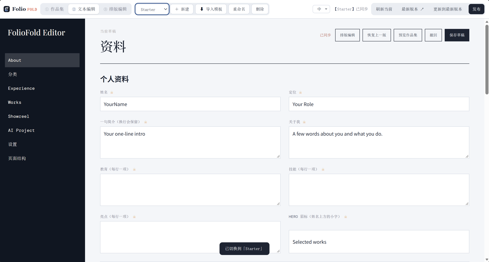
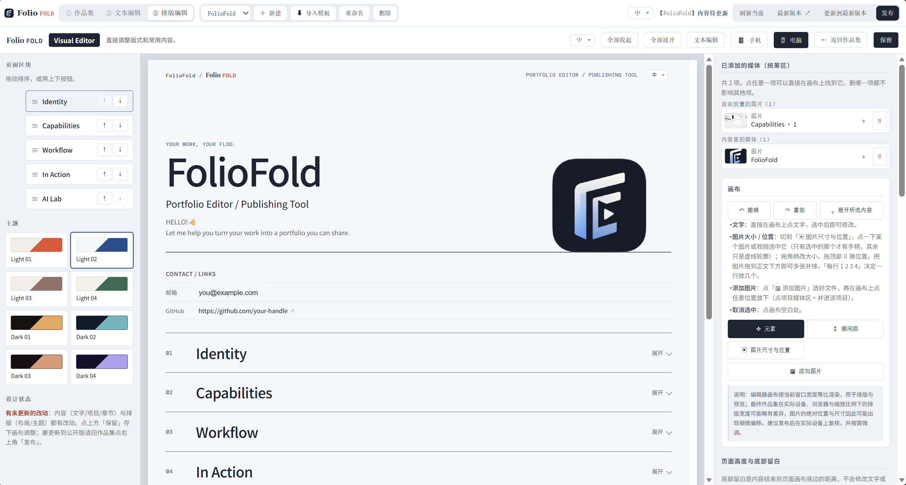

# FolioFold

FolioFold 把你散落的经历、作品与想法，整理成一份**内容组织清晰、信息完整、条理分明**的简历 / 作品集，并在同一套界面里完成编辑、排版与发布——本地优先，随时预览，发布即上线。

FolioFold helps you turn scattered experience, work and ideas into a **résumé/portfolio that is clearly organized, complete and well-structured** — edit, lay out and publish from one unified workspace, preview as you go, and go live the moment you publish.

> Less fighting with layouts, more time making your résumé/portfolio look like you.

---

## ✨ Try the FolioFold Demo

- **[打开 FolioFold Demo](https://zero-sara.github.io/FolioFoldPages/)**

这是公开的展示示例，可以看 FolioFold 做出来的实际效果。

### 🖼️ 产品截图 / Screenshots

**文本编辑 / Text editor** — 按区块结构化地编辑内容（About / Experience / Works / Showreel…）



**排版编辑 / Visual (layout) editor** — 拖拽调整区块顺序与留白、切换主题，实时预览成品



---

## ⚡ Quick Start

> FolioFold 是**本地运行**的软件，需要你本机有 **Git** 和 **Python**。**不需要**手动 `pip install` 任何东西——FolioFold 自身没有第三方依赖。
>
> **已验证支持 Python 3.8–3.12**（已在真机逐一启动并通过健康检查：3.8.20、3.9.25、3.10.21、3.11.6、3.12.14）。**Python 3.13 及以上目前无法运行**：项目依赖的 `cgi` 模块已在 3.13 移除。

1. 安装 [Git](https://git-scm.com/downloads) 与[官方 Python](https://www.python.org/downloads/windows/) **3.8–3.12** 中的任一版本
2. `git clone https://github.com/zero-sara/FolioFold.git`，然后进入 `FolioFold` 目录
3. 双击 **`FolioFold 启动.bat`**，浏览器会打开 <http://127.0.0.1:3000/>
4. 关闭时双击 **`FolioFold 停止.bat`**（只停 FolioFold 自己的服务，不影响其他程序）

---

## 🤖 让 AI 帮我安装

不想自己敲命令？按你要制作的版本，复制**其中一整段**给任意 AI 助手（ChatGPT / Claude / 本机 AI 助手等）。两段不能混用。

### A. 单语言固定版（隐藏语言切换）

> **请先填写：`<固定语言代码>`**。可选：`zh-CN`、`zh-TW`、`en`、`ja`、`ko`、`fr`、`es`、`it`、`de`、`pt`。

```
请帮我在我的电脑上安装并启动 FolioFold 的“单语言固定版”（本地运行的简历 / 作品集编辑器）。
我要固定的语言是：<固定语言代码>。这个版本必须隐藏语言切换入口；不需要、也不要保留语言切换。

按“检测 → 安装/复检 → clone → 配置 → 端口保护 → 启动 → 健康检查 → 说明停止方式”的顺序完成。不要假定环境已经就绪。

1) 检测环境
   - 检查是否安装了 Git（git --version）。
   - 列出已安装的 Python 版本（Windows 先跑 `py -0p`，并用 `python --version` / `python3 --version` 复检）。
   - 可用版本是 Python 3.8–3.12；3.13 及以上不能运行。
2) 安装并复检缺失项
   - 缺 Git 或兼容 Python 时，先告诉我需要安装什么并征得同意；Windows 可用 winget 或 Python 官方下载页：https://www.python.org/downloads/windows/
   - 安装后重新检测，确认 Git 与 Python 3.8–3.12 确实可用。
3) Clone 与单语言配置
   - 在我选择的位置检查是否已有 FolioFold；没有才执行 `git clone https://github.com/zero-sara/FolioFold.git` 并进入目录。
   - 在 `dist-config.js` 设置 `langMode: 'single'` 与 `defaultLang: '<固定语言代码>'`；确认界面没有语言切换入口。
4) 端口保护与启动
   - 检查 127.0.0.1:3000 是否被占用。
   - 若占用者是已经在运行的 FolioFold，直接打开浏览器即可，不要重复启动。
   - 若是别的程序占用，不要结束它；请告诉我，并给出可行的解决办法。
   - Windows：运行项目根目录的「FolioFold 启动.bat」。
5) 健康检查与停止
   - 访问 http://127.0.0.1:3000/api/version 与 http://127.0.0.1:3000/api/health，
     确认都返回 200。
   - 告诉我关闭方法：Windows 双击「FolioFold 停止.bat」；或在运行它的终端里按 Ctrl+C。
```

### B. 多语言版（保留语言切换）

> **无需填写语言代码。** 此版保留内置的语言切换入口，不要改成单语言版。

```
请帮我在我的电脑上安装并启动 FolioFold 的“多语言版”（本地运行的简历 / 作品集编辑器）。
必须保留语言切换功能；不要修改 `dist-config.js` 的语言模式。

按“检测 → 安装/复检 → clone → 端口保护 → 启动 → 健康检查 → 说明停止方式”的顺序完成。不要假定环境已经就绪。

1) 检测：检查 Git（git --version）与所有 Python（Windows 先跑 `py -0p`，并用 `python --version` / `python3 --version` 复检）。可用 Python 是 3.8–3.12；3.13 及以上不能运行。
2) 安装/复检：缺 Git 或兼容 Python 时，先列出需要安装的内容并征得同意；Windows 可用 winget 或 Python 官方下载页：https://www.python.org/downloads/windows/。安装后重新检测，确认 Git 与 Python 3.8–3.12 可用。
3) Clone：在我选择的位置检查是否已有 FolioFold；没有才执行 `git clone https://github.com/zero-sara/FolioFold.git` 并进入目录。
4) 端口保护与启动：检查 127.0.0.1:3000。已是 FolioFold 就直接打开；若是别的程序占用，不要结束它，告诉我解决办法。没有冲突时，在 Windows 运行项目根目录的「FolioFold 启动.bat」。
5) 健康检查与停止：访问 http://127.0.0.1:3000/api/version 与 http://127.0.0.1:3000/api/health，确认都返回 200；关闭时双击「FolioFold 停止.bat」，或在运行它的终端按 Ctrl+C。
```

> 需要切换版本时，请重新按对应指令设置；不要把单语言版与多语言版的配置混在一起。

---

**[中文说明 ↓](#中文说明)** ・ **[English ↓](#english)**

---

## 中文说明

### FolioFold 是什么

一个运行在本地的个人简历 / 作品集编辑器与发布工具。不需要构建工具，也不需要联网：在本机启动它，用浏览器打开，就能一边编辑一边看到真实效果。

做好的简历 / 作品集可以留在本地，也可以发布成公开可访问的网站，或者导出成单个 HTML 文件、ZIP 或 PDF。

内容和视觉是分开存放的——改文字不会弄坏排版，改排版也不会弄丢内容。

### 它能做什么

- **编辑内容**：About / Experience / Works / Showreel 等区块，包含文字、图片、视频，以及 Showreel 章节时间点
- **调整视觉**：拖拽区块顺序、调整留白、在画布上直接改文字、切换配色主题（内置多套浅色 / 深色预设）
- **实时预览**：改动立刻反映在预览里，所见即所得
- **内置两套模板**：Starter 与 FolioFold Demo（见下）；也可以把一套版式导出成模板文件，在别处导入套用
- **单语言 / 多语言**：默认完整多语言（中英文等随意切换）；想做成单语言发行物，只改 `dist-config.js` 一个开关即可隐藏所有语言切换入口
- **本地优先**：内容和设计都存成本机文件，方便复制、备份、版本管理
- **发布与导出**：发布到 GitHub Pages，或导出 HTML / ZIP / PDF

### 内置模板

FolioFold 自带两个模板：Starter 和 FolioFold Demo。
Starter 是你开始制作自己的简历 / 作品集的起点；FolioFold Demo 用来查看完整示例。
你可以直接编辑 Starter，并把它逐步变成自己的项目。

| 模板 | 用途 |
|---|---|
| **Starter** | 你的起点。自带基本排版、栏目和可编辑的示例内容，直接改就能变成自己的简历 / 作品集，不需要从空白开始 |
| **FolioFold Demo** | 官方演示模板，用来查看 FolioFold 的完整效果；不作为制作自己内容的默认起点 |

你也可以继续导入或制作其他模板：把一套版式导出成模板文件（只含视觉设计，不含文字和媒体），在别处导入套用。

### 🛠️ 开始使用

FolioFold 已实际验证 **Python 3.8–3.12**（3.8.20、3.9.25、3.10.21、3.11.6、3.12.14）；**Python 3.13 及以上无法运行**，因为项目依赖的 `cgi` 模块已在 3.13 移除。你还需要 **Git**，但 FolioFold 自身没有第三方依赖，**不需要** `pip install`。

```bash
git clone https://github.com/zero-sara/FolioFold.git
cd FolioFold
```

然后双击 **`FolioFold 启动.bat`**，在浏览器打开 <http://127.0.0.1:3000/>；关闭时双击 **`FolioFold 停止.bat`**。

Windows 用户直接双击项目根目录的 **`FolioFold 启动.bat`**；关闭时双击 **`FolioFold 停止.bat`**。启动前会检查端口，停止脚本只停 FolioFold 自己的服务。

### Python 环境

运行 FolioFold 需要 **Python 3.8–3.12**。推荐普通用户直接安装其中仍受官方支持的版本。

- **已验证支持**：Python 3.8–3.12
- **已确认不能用**：Python 3.13 及以上（`cgi` 已移除）
- **Windows 用户下载**：[Python 官方下载页](https://www.python.org/downloads/windows/)
- 安装完成后，再双击 **`FolioFold 启动.bat`** 即可。

### 🚀 发布与导出

简历 / 作品集做好之后：

- **发布到 GitHub Pages**：用你自己的 GitHub 账号授权（设备码流程，不需要你创建 OAuth App），FolioFold 会帮你建 / 更新仓库并启用 Pages
- **导出 ZIP**：完整的静态站点，可以放到任意托管平台
- **导出单文件 HTML**：一个文件，离线也能打开
- **导出 PDF**：用浏览器打印成 PDF

#### 发布后的网址长什么样

```
https://<你的 GitHub 用户名>.github.io/FolioFoldPages/<子路径>/
```

- **仓库名**默认是 `FolioFoldPages`（在 `server.py` 的 `GH_PUBLISH_REPO` 里固定）。它建在**你自己**的 GitHub 账号下，不会占用别人的空间。1.0 暂不支持在发布面板里自定义仓库名（这是计划中的增强项）；GitHub 的仓库名是按「账号命名空间」独立的——不同用户可以用同名仓库，但同一账号下不能重名。
- **子路径**可以在发布面板里自己填，用来区分多份简历 / 作品集；留空就是仓库根目录。
- Pages 的启用是 FolioFold 自动做的，你不需要手动去 GitHub 设置里开。
- ⚠ **发布用的这个仓库建好后，建议不要改名、也不要设为私有**：改名会让旧的 Pages 链接直接失效（GitHub 不会对项目站点做重定向），设为私有会让 Pages 返回 404；如果确实需要改名，改名后请重新发布一次，并更新你发出去的所有旧链接。

⚠️ **改名的后果（GitHub 的真实行为，不是猜测）**：

- **改 GitHub 用户名** → 你名下仓库的引用会自动跳转到新用户名，但**旧的个人主页和 gist 链接会 404**。Pages 站点**不在**自动重定向范围内：旧的 `https://旧用户名.github.io/FolioFoldPages/` 会直接失效（返回 404），只有新用户名下的 `https://新用户名.github.io/FolioFoldPages/` 能用。FolioFold 在「重新发布 / 更新当前发布」时会用实时授权身份取到新用户名并更新本机发布记录，所以改完用户名后点一次「重新发布」即可让链接回到最新。
- **改 Pages 仓库名** → 按 GitHub 官方文档，**项目站网址不在重定向范围内**，旧的 `https://<用户名>.github.io/<旧仓库名>/` 会直接失效。改名后请重新发布，并更新你发出去的旧链接。

### 媒体文件放在哪

上传的图片、音频、视频**都保存在本机项目目录 `public/media/` 下**，按用途分好类：`experience/`（经历）、`projects/`（作品）、`showreel/`（片头视频）、`ai-voices/`（配音）、`brand/`（品牌图标）、`uploads/`（原始上传）。

发布时只会上传**当前内容真正引用到的**那部分媒体，未被引用的文件不会跟着上线。反过来，你在本机删掉某个媒体后，它在 `public/media/` 里的文件会保留下来，方便你随时恢复。

⚠ **`public/media/` 不能整目录删除**：里面既有当前内容正在引用的媒体，也有大量历史遗留文件。删除前请先用引用检查确认某个文件已无任何内容引用——当前内容正在引用的媒体（本机实测约 870MB）一旦删除，会导致线上页面缺图 / 缺视频。未被引用的历史遗留媒体（本机实测约 800MB）可以安全归档 / 删除，但不会因「发布」而被自动清除。构建缓存目录（`release/`、`build/`、`__pycache__/`）同样可以直接删除，不影响任何内容。

### 你的数据留在本机

FolioFold 没有自己的服务器。内容、媒体和令牌都只存在你的电脑上，涉及凭据的文件都不会进入仓库。内容与设计分开保存，每次保存都会留一份上一版，方便回滚。

### 隐私边界（概念澄清）

- **发布仓库（FolioFoldPages）里出现你的真实姓名、联系方式、作品，是正常且预期的**——那是你主动发布的内容，不是泄露。
- **源码仓库（FolioFold 本体）不能包含任何私人信息**：所有私人内容都在你本机 `content/` 下（已被 `.gitignore` 排除），不会进入公开源码。
- **你未用于公开发布的私人内容，不应被发布到公开的 Pages 仓库**：发布面板只会发布你明确选择发布的模板；如果你发现不该公开的内容被发了出去，那属于需要修正的问题。

---

## English

### What FolioFold is

A résumé/portfolio editor and publisher that runs on your own machine. No build step, no cloud account — start it locally, open it in a browser, and edit while looking at the real thing.

Keep it private, publish it as a public site, or export it as a single HTML file, a ZIP, or a PDF.

Content and visual design are stored separately, so editing your words never breaks your layout, and tweaking the layout never touches your words.

### What you can do

- **Write your content** — about, experience, projects, showreel sections, images, video and showreel chapter markers
- **Shape the look** — reorder sections by dragging, adjust spacing, edit text right on the page, switch between built-in light and dark themes
- **Preview as you go** — changes show up immediately
- **Start from a template** — two built-in templates (see below); export or import a look you like
- **Single-language or multi-language** — full i18n by default (switch between languages freely); to ship a single-language build, flip one switch in `dist-config.js` to hide all language switchers
- **Stay local** — everything lives in plain files on your machine, easy to copy, back up, or version control
- **Publish or export** — push to GitHub Pages, or export HTML / ZIP / PDF

### Built-in templates

FolioFold ships with two templates: Starter and FolioFold Demo.
Starter is where you begin making your own résumé/portfolio; FolioFold Demo is for seeing the full example.
You can edit Starter directly and gradually turn it into your own project.

| Template | What it's for |
|---|---|
| **Starter** | Your starting point. It comes with basic layout, sections and editable sample content — edit it into your own résumé/portfolio instead of starting from blank. |
| **FolioFold Demo** | The official demo template for viewing what FolioFold can produce; not the default starting point for making your own content. |

You can also import or make other templates: export a look as a template file (visual design only, no text or media) and import it elsewhere.

### 🛠️ Getting started

FolioFold has been actually verified on **Python 3.8–3.12** (3.8.20, 3.9.25, 3.10.21, 3.11.6 and 3.12.14). **Python 3.13 and later cannot run it**, because the `cgi` module it uses was removed in 3.13. You also need **Git**, but FolioFold itself has no third-party dependencies, so there is **nothing to `pip install`**.

```bash
git clone https://github.com/zero-sara/FolioFold.git
cd FolioFold
```

Then double-click **`FolioFold 启动.bat`** and open <http://127.0.0.1:3000/>. To stop it, double-click **`FolioFold 停止.bat`**.

On Windows, just double-click **`FolioFold 启动.bat`** in the project root; to stop, double-click **`FolioFold 停止.bat`**. The start script protects an occupied port, and the stop script only stops FolioFold itself.

### Python environment

Running FolioFold requires **Python 3.8–3.12**. Ordinary users are recommended to install a still-supported version from the official Python site.

- **Verified supported**: Python 3.8–3.12
- **Confirmed incompatible**: Python 3.13 and later (`cgi` was removed)
- **Windows users**: download from the official [Python Releases for Windows](https://www.python.org/downloads/windows/)
- After installing, just double-click **`FolioFold 启动.bat`** to start.

### 🤖 Let an AI install it for me

Don't want to type the commands yourself? Copy **one complete block** below to an AI assistant. Do not mix the two versions.

### A. Fixed single-language version (hide the language switcher)

> **Fill in `<FIXED_LANGUAGE_CODE>` first**: `zh-CN`, `zh-TW`, `en`, `ja`, `ko`, `fr`, `es`, `it`, `de`, or `pt`.

```
Install and start FolioFold's fixed single-language version for me. My fixed language is <FIXED_LANGUAGE_CODE>. Hide the language-switching UI completely; do not leave a language switcher available.

Work in this order: detect → install/re-check → clone → configure → protect the port → start → health-check → explain how to stop. Do not assume the environment is ready.

1) Detect Git (`git --version`) and every installed Python (on Windows: `py -0p`, then `python --version` / `python3 --version`). Python 3.8–3.12 is compatible; 3.13+ is not.
2) Install/re-check missing items. Before installing Git or a compatible Python, list what is needed and get my consent. On Windows, use winget or https://www.python.org/downloads/windows/; then re-check that Git and Python 3.8–3.12 are usable.
3) Clone only if needed: in my chosen location, check whether FolioFold exists; otherwise run `git clone https://github.com/zero-sara/FolioFold.git` and enter it.
4) Configure `dist-config.js` with `langMode: 'single'` and `defaultLang: '<FIXED_LANGUAGE_CODE>'`; confirm the UI has no language switcher.
5) Protect the port and start: check 127.0.0.1:3000. If it is FolioFold, open it without a second start. If it belongs to another program, do not stop it; explain the solution. Otherwise run `FolioFold 启动.bat` on Windows.
6) Health-check and stop: verify both http://127.0.0.1:3000/api/version and http://127.0.0.1:3000/api/health return 200. Explain that Windows users stop it with `FolioFold 停止.bat` (or Ctrl+C in the running terminal).
```

### B. Multi-language version (keep the language switcher)

> **No language code is needed.** Keep the built-in language switcher; do not change the language mode in `dist-config.js`.

```
Install and start FolioFold's multi-language version for me. Keep language switching enabled and do not change the language mode in `dist-config.js`.

Work in this order: detect → install/re-check → clone → protect the port → start → health-check → explain how to stop. Do not assume the environment is ready.

1) Detect Git (`git --version`) and every installed Python (on Windows: `py -0p`, then `python --version` / `python3 --version`). Python 3.8–3.12 is compatible; 3.13+ is not.
2) Install/re-check missing items. Before installing Git or a compatible Python, list what is needed and get my consent. On Windows, use winget or https://www.python.org/downloads/windows/; then re-check that Git and Python 3.8–3.12 are usable.
3) Clone only if needed: in my chosen location, check whether FolioFold exists; otherwise run `git clone https://github.com/zero-sara/FolioFold.git` and enter it.
4) Protect the port and start: check 127.0.0.1:3000. If it is FolioFold, open it without a second start. If it belongs to another program, do not stop it; explain the solution. Otherwise run `FolioFold 启动.bat` on Windows.
5) Health-check and stop: verify both http://127.0.0.1:3000/api/version and http://127.0.0.1:3000/api/health return 200. Explain that Windows users stop it with `FolioFold 停止.bat` (or Ctrl+C in the running terminal).
```

> To change editions later, follow the appropriate complete instruction again; do not mix the single- and multi-language settings.

### 🚀 Publish & export

When your résumé/portfolio is ready:

- **GitHub Pages** — authorize with your own GitHub account (device flow, no OAuth app to create); FolioFold creates or updates the repo and enables Pages
- **ZIP** — a complete static site you can host anywhere
- **Single-file HTML** — one file you can open offline
- **PDF** — print your published portfolio to PDF

#### What your published URL looks like

```
https://<your-github-username>.github.io/FolioFoldPages/<sub-path>/
```

- The **repository name** defaults to `FolioFoldPages` (fixed in `GH_PUBLISH_REPO` in `server.py`). It is created under **your own** account. Customizing the repo name from the publish panel is not in 1.0 (planned enhancement); GitHub repo names are per-account namespace — different users may share a name, but one account cannot have two repos with the same name.
- The **sub-path** is editable in the publish panel — use it to keep several résumés/portfolios apart; leave it empty to publish at the repository root.
- FolioFold enables GitHub Pages for you. You don't have to flip anything in GitHub's settings.
- ⚠ **Once this publish repository is created, we recommend you do not rename it and do not make it private**: renaming breaks the old Pages link immediately (GitHub does not redirect project sites), and making it private makes Pages return 404. If you must rename, republish afterwards and update any links you shared.

⚠️ **What renaming actually does (GitHub's documented behaviour, not guesswork)**:

- **Renaming your GitHub username** — references to your repositories redirect automatically, but your **old profile page and old gists return 404**. GitHub Pages sites are **not** redirected: the old `https://old-username.github.io/FolioFoldPages/` stops working (404) and only `https://new-username.github.io/FolioFoldPages/` works. FolioFold reads the live authenticated username when you **republish / update current publish**, so doing that once after a username change refreshes your stored link.
- **Renaming the Pages repository** — per GitHub's docs, **project site URLs are not included in the redirect**, so `https://<username>.github.io/<old-repo>/` breaks immediately. Republish afterwards and update any links you shared.

### Where media files live

Uploaded images, audio and video are stored locally under `public/media/`, sorted by purpose: `experience/`, `projects/`, `showreel/`, `ai-voices/`, `brand/`, `uploads/`.

Publishing uploads **only the media your content actually references** — unreferenced files never go online. Conversely, removing a media item from your portfolio leaves its file on disk for easy recovery.

⚠ **Do not delete `public/media/` as a whole**: it holds both media your current content references and a large amount of legacy files. Before deleting anything, confirm via a reference check that the file is no longer referenced — the media your current content references (≈870MB on this machine) must stay or your live pages will lose images/videos. Unreferenced legacy media (≈800MB on this machine) is safe to archive/delete, but it is never removed automatically by publishing. Build-cache directories (`release/`, `build/`, `__pycache__/`) can also be deleted freely without affecting any content.

### Your data stays local

FolioFold has no server of its own. Your content, media and tokens stay on your machine, and credential files never enter the repository. Each save keeps a previous version you can roll back to.

### Privacy boundary (concept clarification)

- **Seeing your real name, contact info, or work inside the publish repository (FolioFoldPages) is normal and expected** — that is content you chose to publish, not a leak.
- **The source repository (FolioFold itself) must contain no personal information**: all private content lives in `content/` on your machine (excluded by `.gitignore`) and never enters the public source.
- **Private content you did not intend to publish must never end up in the public Pages repository**: the publish panel only publishes the template you explicitly choose; if something you did not intend to publish goes live, that is a bug to fix.

---

## License

[MIT](./LICENSE) © FolioFold contributors.

本仓库只包含 FolioFold 本体和一份公开 Demo，不含任何个人作品集——你自己的数据只存在于本机，不会被提交。

This repository ships the FolioFold app itself and a public demo. It contains no personal portfolio; your own data lives only on your machine and is never committed.
